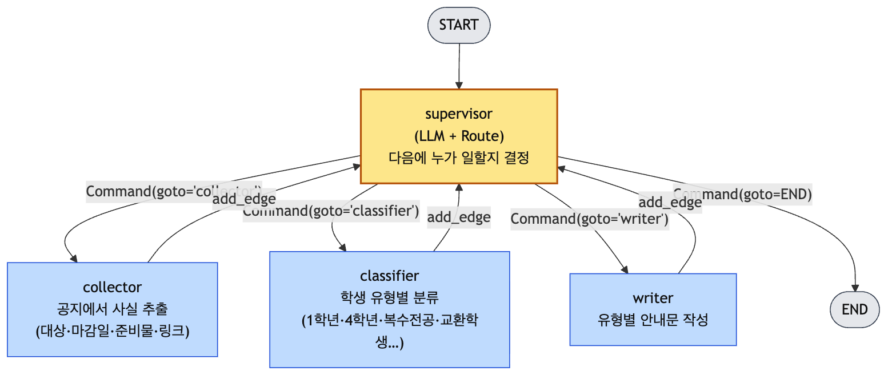
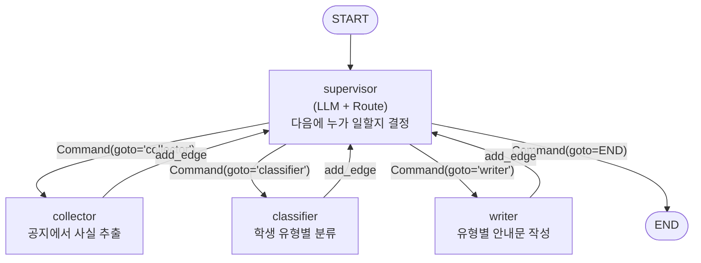
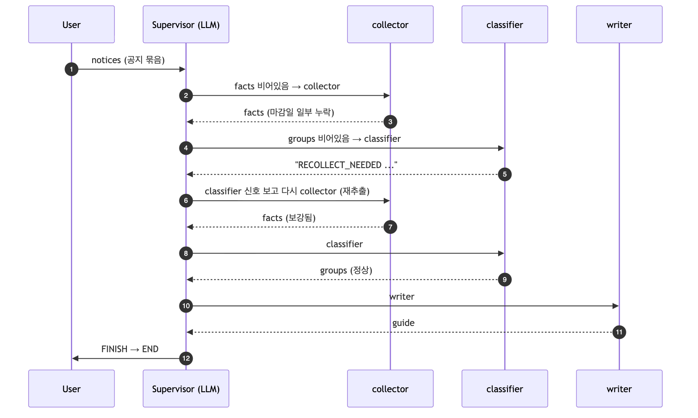
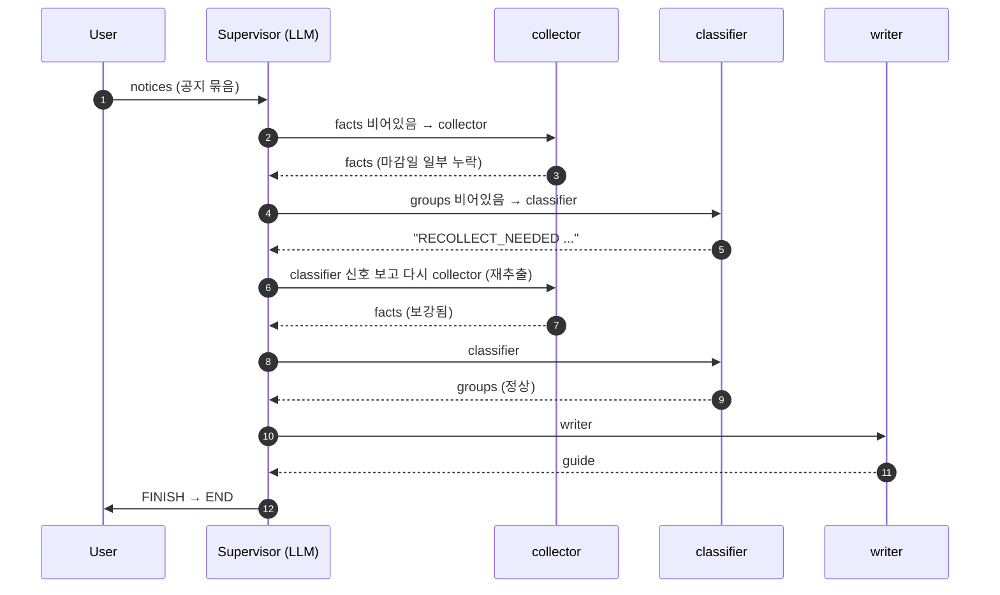
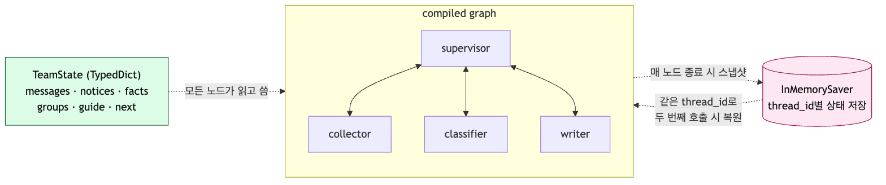
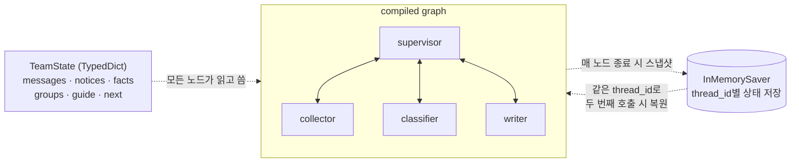

# Week 10 — Supervisor 그래프 조립 다이어그램

> 10주차 [덩어리 3 — 그래프 조립](../week-10.md#덩어리-3--그래프-조립-edge가-흐름이다)에서 설명한 LangGraph 구조의 시각화.
> 모든 그림은 PNG로 사전 렌더되어 PDF·HTML·GitHub 어디서든 보인다. 원본 Mermaid 소스는 같은 폴더의 `*.mmd` 파일.

---

## 1. 전체 그래프 (정상 흐름)



<details>
<summary>Mermaid 소스 보기</summary>



</details>

**읽는 법**

- 노란색 `supervisor` = LLM 라우터. 매번 다시 호출된다.
- 파란색 = 작업자(collector / classifier / writer). 끝나면 *반드시* supervisor로 돌아간다 (`add_edge`).
- supervisor → 작업자 화살표는 `Command(goto=...)`가 만든다.
- supervisor → END는 `route.next == "FINISH"`일 때.

---

## 2. RECOLLECT_NEEDED 분기 (동적 라우팅)

classifier가 "사실이 부족해 분류 불가"라고 판단하면 supervisor가 다시 collector로 보낸다 — *조건문이 아니라* LLM이 결정한다.



<details>
<summary>Mermaid 소스 보기</summary>



</details>

**여기서 본 것**: 화살표 5번 `S → C` (재추출) — supervisor가 *언어적 단서* "RECOLLECT_NEEDED"를 읽고 분기를 바꿨다. 이게 9주차에서 말한 "**상황에 따라 다음 역할을 바꾼다**"의 코드 위 실체.

---

## 3. 공유 상태(TeamState)와 Checkpointer

그래프 외곽을 감싸는 두 요소:



<details>
<summary>Mermaid 소스 보기</summary>



</details>

**읽는 법**

- `TeamState`는 *모든 노드가 같이 보는* 공유 메모리. 각 노드는 자기에게 필요한 필드만 읽고, 결과를 자기 필드에 쓴다.
- `InMemorySaver`는 매 노드 종료 시점의 상태를 `thread_id` 키로 저장. 두 번째 `invoke()`에서 같은 `thread_id`면 이전 상태가 복원된다.

---

## 4. 코드 ↔ 다이어그램 매핑

| 다이어그램 요소 | 코드 위치 (`supervisor.py`) |
|---|---|
| `supervisor` 노드 | `def supervisor(state) -> Command:` |
| `Command(goto='...')` 화살표 | supervisor 함수 반환값 |
| 작업자 → supervisor 점선 | `builder.add_edge("researcher", "supervisor")` 등 |
| `START` 노드 | `builder.add_edge(START, "supervisor")` |
| 그래프 전체를 감싸는 박스 | `builder.compile(checkpointer=InMemorySaver())` |
| TeamState 사이드 박스 | `class TeamState(TypedDict): ...` |

---

## 다이어그램 다시 그리기

소스를 수정한 뒤 PNG를 재생성하려면:

```bash
cd docs/diagram
./render.sh                  # 모든 .mmd → .png 일괄 렌더
# 또는 개별:
./render.sh week10_assembly_full.mmd
```

`render.sh`는 mermaid-cli + 시스템 Chrome으로 렌더한다 (puppeteer-config.json 사용).

---

## 참고

- 본 다이어그램은 [week-10.md](../week-10.md)의 *덩어리 3* 외 여러 섹션에서 직접 참조된다.
- Mermaid 문법: https://mermaid.js.org/syntax/flowchart.html
